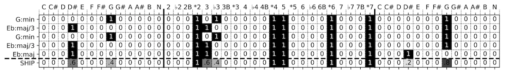

# harmonicintervalprofile

Python library for computing **(Shared) Harmonic Interval Profiles (HIP and SHIP)** features from chord labels.

Several chord-label representations have been proposed in computational harmony research, of which chroma is most commonly used. This package contains methods to create and manipulate a new representation that captures a harmonic interval profile (HIP) of chord labels. We have shown in [[**research**]](https://rdcu.be/7sr2) that this representation can be effectively used to [[**personalize chord labels**]](https://github.com/hvkoops/chordlabelpersonalization).

**Note**: This library is functional, but in its infancy. 

The rationale behind the HIP is that most chords can be reduced to the root note and a set of intervals relative to the root, where the amount and combination of intervals determines the chord quality and possible extensions. The HIP captures this intuition by reducing a chord label to its root note, interval profile and bass note.



Our [[**Deep Learning for Music@IJCNN 2017**]](https://arxiv.org/pdf/1706.09552) paper proposed to use HIP that contains a concatenation of three one-hot vectors: roots, thirds sevenths. In this paper, we use a larger HIP, to account for more intervals and inversions. The HIP in our [[**Neural Computing and Applications**]](https://rdcu.be/7sr2) publication contains a concatenation of a couple of vectors: roots, intervals, and inversions. With these vectors, we can encode all possible chord labels. The first vector is of size 13 and denotes the 12 chromatic root notes (C... B) + a “no chord” (N) bin. The second vector is of size 4 and denotes if the chord denoted by the chord label contains a major second (2), minor second (♭2), both major and minor (2B) or no second (⋆2) relative to the root note. The third vector, also of size 4 represents the same, but for thirds (3, ♭3, 3&♭3, ⋆3). The fourth vector denotes the fourth intervals (♯4, ♭4, ♯4&♭4, ⋆4).

The fifth vector, of size 2, denotes whether the chord contains a fifth (5 or ⋆5). The sixth vector, size 4, denotes the sixth intervals (♯6, ♭6, ♯6&♭6, ⋆6). The seventh vector denotes the sevenths intervals (♯7, ♭7, ♯7&♭7, ⋆7). With these intervals, combined with the root and bass, we can represent and evaluate every chord label in the [[**CASD**]](http://www.github.com/chordify/casd) and [[**Billboard**]](http://ddmal.music.mcgill.ca/research/billboard) (BB) using the standard MIREX ACE evaluation measures. The HIP can be extended or reduced to other intervals as well. The figure below shows a number of example chord labels and their HIP equivalent.

To capture the harmonic content shared among different HIP, we we create a Shared Harmonic Interval Profile SHIP by computing the columnwise arithmetic mean of multiple HIPs. The last row of the figure below shows an example of the SHIP created from the HIPs above it. By averaging, we create a fuzzy chord representation: the SHIP essentially contains a concatenation of probability density functions for the root, bass and each stacked intervals. These probability density functions express the average harmonic content shared among the annotators' chord labels. Instead of the classical \ace{} approach of trying to estimate just a single chord label, we propose to estimate this fuzzy representation from audio.

## Example use:

Compute a Harmonic Interval Profile (HIP) from a chord label:

```python 
import harmonicintervalprofile as hip 
>>> label_hip = hip.label_to_hip('Eb:maj/3')
>>> label_hip
array([0, 0, 0, 1, 0, 0, 0, 0, 0, 0, 0, 0, 0, 0, 0, 0, 1, 1, 0, 0, 0, 0,
       1, 1, 0, 0, 0, 0, 1, 0, 0, 0, 1, 0, 0, 0, 0, 1, 0, 0, 0, 0, 0, 0,
       0, 0])
```

Compute a Shared Harmonic Interval Profile (SHIP) from multiple chord labels:

```python 
>>> chord_labels = ['G:min', 'Eb:maj/3', 'G:min', 'Eb:maj/3', 'Eb:maj'] 
>>> hips = np.array([hip.label_to_hip(c) for c in chord_labels]) 
>>> hips 
array([[0, 0, 0, 0, 0, 0, 0, 1, 0, 0, 0, 0, 0, 0, 0, 0, 1, 0, 1, 0, 0, 0,
        1, 1, 0, 0, 0, 0, 1, 0, 0, 0, 1, 1, 0, 0, 0, 0, 0, 0, 0, 0, 0, 0,
        0, 0],
       [0, 0, 0, 1, 0, 0, 0, 0, 0, 0, 0, 0, 0, 0, 0, 0, 1, 1, 0, 0, 0, 0,
        1, 1, 0, 0, 0, 0, 1, 0, 0, 0, 1, 0, 0, 0, 0, 1, 0, 0, 0, 0, 0, 0,
        0, 0],
       [0, 0, 0, 0, 0, 0, 0, 1, 0, 0, 0, 0, 0, 0, 0, 0, 1, 0, 1, 0, 0, 0,
        1, 1, 0, 0, 0, 0, 1, 0, 0, 0, 1, 1, 0, 0, 0, 0, 0, 0, 0, 0, 0, 0,
        0, 0],
       [0, 0, 0, 1, 0, 0, 0, 0, 0, 0, 0, 0, 0, 0, 0, 0, 1, 1, 0, 0, 0, 0,
        1, 1, 0, 0, 0, 0, 1, 0, 0, 0, 1, 0, 0, 0, 0, 1, 0, 0, 0, 0, 0, 0,
        0, 0],
       [0, 0, 0, 1, 0, 0, 0, 0, 0, 0, 0, 0, 0, 0, 0, 0, 1, 1, 0, 0, 0, 0,
        1, 1, 0, 0, 0, 0, 1, 0, 0, 0, 1, 1, 0, 0, 0, 0, 0, 0, 0, 0, 0, 0,
        0, 0]]) 
```

A SHIP is the average of multiple HIPs:

```python 
>>> ship(hips) 
    array([0. , 0. , 0. , 0.6, 0. , 0. , 0. , 0.4, 0. , 0. , 0. , 0. , 0. ,
       0. , 0. , 0. , 1. , 0.6, 0.4, 0. , 0. , 0. , 1. , 1. , 0. , 0. ,
       0. , 0. , 1. , 0. , 0. , 0. , 1. , 0.6, 0. , 0. , 0. , 0.4, 0. ,
       0. , 0. , 0. , 0. , 0. , 0. , 0. ])
```

## Dependencies:

* `mir_eval`
* `numpy`
* `re`

If you use ```harmonicintervalprofile``` in a research project, please cite the following paper:

Koops, H.V., de Haas, W.B., Bransen, J. et al. "Automatic chord label personalization through deep learning of shared harmonic interval profiles" Neural Computing & Applications Springer 2018 https://doi.org/10.1007/s00521-018-3703-y 

```
@Article{Koops2018,
author="Koops, Hendrik Vincent and de Haas, W. Bas and Bransen, Jeroen and Volk, Anja",
title="Automatic chord label personalization through deep learning of shared harmonic interval profiles",
journal="Neural Computing and Applications",
year="2018",
month="Sep",
day="21",
issn="1433-3058",
doi="10.1007/s00521-018-3703-y",
url="https://doi.org/10.1007/s00521-018-3703-y"
}
```
